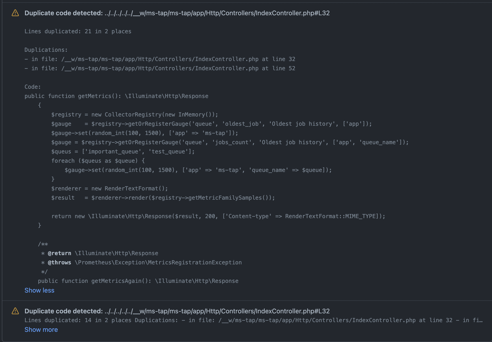

# CPD GitHub Action

This action pushes results from [PCPD](https://github.com/sebastianbergmann/phpcpd) as check run annotations. :rocket:

The action can also be used for any other static analysis tools that produce reports in the PMD XML format.
The report itself must be generated in a former build step, for example a Maven build.



## Input

### `path`
Required. A file, directory or wildcard pattern that describes where to find the reports.
Multiple files can be processed through a [glob expression](https://github.com/actions/toolkit/tree/master/packages/glob), for example: `'**/pmd.xml'`.

### `name`
Optional. Name for the check run to create. Defaults to `PMD`.

### `title`
Optional. Title for the check run to create. Defaults to `PMD Source Code Analyzer report`.

### `token`
Optional. GitHub API access token. Defaults to `${{ github.token }}`, which is set by `actions/checkout@v2` minimally.

## Example usage

```yaml
name: Java CI

on: [push]

jobs:
  build:
    runs-on: ubuntu-latest
    steps:
    - uses: actions/checkout@v2
    # ...run copy paste detector
    - uses: mihaisee/pcpd-github-action@master
      with:
        path: '**/cpd.xml'
```

Please note that by default workflows on `pull_request` events checkout [`refs/pull/:prNumber/merge`](https://help.github.com/en/actions/reference/events-that-trigger-workflows) instead of the head of the pull request.
Due to this, line numbers for the generated violations may not align with the actual line numbers to which they are displayed on the `HEAD`.
As it is, there is not really a sensible way to run this action on the merge commit of the pull request, because the result would be posted to an unnamed workflow for an otherwise invisible commit.
Even for `pull_request` events there is the possibility to checkout the pull request head instead. In order to do so, change your `checkout` action accordingly:

```yaml
- uses: actions/checkout@v2
  with:
    ref: ${{ github.event.pull_request.head.sha }}
```

## Other relevant actions
This is a Github Action in a series of other GitHub Actions. Similar actions include:

* [checkstyle-github-action](https://github.com/jwgmeligmeyling/checkstyle-github-action)
* [pmd-github-action](https://github.com/jwgmeligmeyling/pmd-github-action)
* [spotbugs-github-action](https://github.com/jwgmeligmeyling/spotbugs-github-action)

## Known limitations
Due to GitHub API limitations, we cannot specify to which Workflow Run (or underlying Check Suite) a newly created Check Run should be associated.
As a result, workflows that trigger on several types of events, might push results under another event than the action was run in.
For more information, see: https://github.com/jwgmeligmeyling/pmd-github-action/issues/4

## Contributing

Install the dependencies:

```bash
$ npm install
```

Build the typescript and package it for distribution
```bash
$ npm run build && npm run package
```

Run the tests :heavy_check_mark:  
```bash
$ npm test

 PASS  ./index.test.js
  ✓ throws invalid number (3ms)
  ✓ wait 500 ms (504ms)
  ✓ test runs (95ms)

...
```
